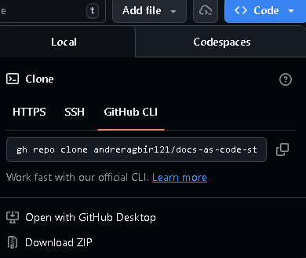
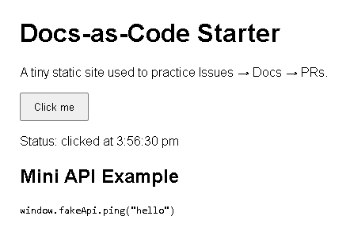

# Sample Web Project

## Description
This project demonstrates a simple web application that displays a header, a status message, and an interactive button. When clicked, the button updates the status with the current time and logs the event to the browser console. It also includes a small JavaScript API (`fakeApi`) that returns an echo message and timestamp when called.

## Features
- **Interactive Button**: Updates status text and logs the click time to the console.
- **Mini API Included**: A `fakeApi` object with a `ping()` method that returns an echo message and timestamp.
- **Responsive Layout**: Basic HTML and CSS structure for a simple static site with minimal stylings.

## Requirements
- A modern web browser (Chrome, Firefox, Edge, etc.)
- Git for cloning and version control/or browser for downloading the repo
- Optional: A code editor like VS Code
- Optional: File extractor like winrar for extracting the zip file if downloaded as zip

## Installation

### Option 1
Clone the repository: run the command in git bash "https://github.com/<your-github-username>/docs-as-code-starter.git" and open the index.html file to run the application

### Option 2
2. On the github repository "https://github.com/andreragbir121/docs-as-code-starter.git", select the code button(blue button), then select download ZIP  and finally extract it anywhere on your desktop and open the index.html file

## Usage
1. Open index.html in your browser.
2. Click the Click me button to update the status message with the current time.
3. Open the browser console (F12 → Console tab) to see the log message.
4. Select the Click Me button and see the API in usage
-  

## Contributor 
- Andre Ragbir refined the readne file with in-depth description and added features, installation and requirements of the application
